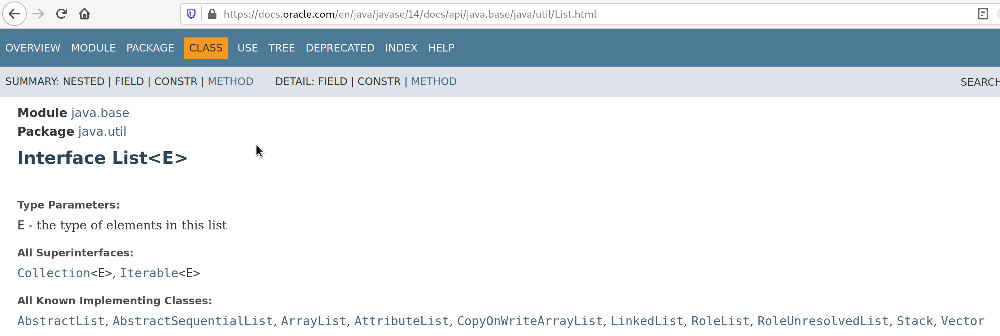

# Training for the next interview

## Cómo correr el código fuente

El código para este mini training está en un proyecto de NetBeans

Para evitarnos problemas sugiero que hagas esto antes que todo:
- Instalar NetBeans (la versión más reciente)
- Instalar la versión más reciente de JDK, yo actualmente estoy usando
Java 14.
- Agregar el directorio "bin" de la instalación de Java al PATH de Windows
o Linux, esto hará posible que invoques el compilador desde la línea de comandos.
Eso realmente no es para efectos del "training", todo programador Java debe tener este setup.
Debe de ser capaz de invocar rápidamente por medio de la línea de comandos
al compilador.

Deberías ser capaz de ver algo así cuando invocas al comando javac y java con su opción **-version**

```
0 [12:11]leo@lein ~ $ javac -version
javac 14
0 [12:11]leo@lein ~ $ java -version
openjdk version "14" 2020-03-17
OpenJDK Runtime Environment (build 14+36-1461)
OpenJDK 64-Bit Server VM (build 14+36-1461, mixed mode, sharing)
0 [12:11]leo@lein ~ $ 
```
- Instalar la versión más reciente de Maven.

## Sobre las clases y la clase Object

Todas las clases extienden de la clase Object, Object es la clase padre de todas las clases.

Si usted por ejemplo explora el **javadoc** para la clase String verá algo así:

https://docs.oracle.com/en/java/javase/14/docs/api/java.base/java/lang/String.html


Es importante que recuerde que todas las clases extienden de Object.

## Sobre la Herencia y el vocabulario

Es importante forjar un vocabulario cuando estamos en un contexto de *Programación Orientada a Objectos* u OOP en inglés (Object Oriented Programming).

Es importante que usted siempre explique la herencia o hable en términos de ella usando frases como:

- "La clase X extiende de la clase Y"
- "La clase X está en la misma jerarquía que Y"
- "Clase X es un Y"
- "La clase X hereda de Y"
- "La clase Y es la clase padre de X"

Y similares ... aquí lo importante es que con estas frases usted da a entender a la persona que escucha
que usted entiende bien quién extiende/hereda de quién.

## "Is-A" "Has-A"

Si usted ve la siguiente declaración de clase:
```java
class Animal {

}
```

Y luego ve la siguiente clase:
```java
class Perro extends Animal {

}
```

Es importante que aterrice la idea de que "Perro" **es un** "Animal". **Es un** por el
simple hecho de que *Perro* está en la misma jerarquía que "Animal".

Lo correcto es explicarlo de la siguiente manera:

- Perro es un Animal
- Perro extiende de Animal
- Perro hereda de Animal
- Animal está arriba de Perro, Perro está abajo de Animal.
- Perro es algo más específico que Animal.

**OJO!**


Es super importante que entiendas esto, hay cosas abstractas y cosas específicas.

Si yo te digo, por favor dibújame un "animal", o si te digo "calcúlame el área de una figura", o si te pregunto "¿qué ruido hace el animal?"

Fíjate que estoy hablando en términos abstractos, porque tu respuestas serían:

- ¿Qué animal puedo dibujar?
- ¿De qué figura calculo el área?
- ¿De qué animal hablamos como para saber qué ruido hace?

Hay cosas que son abstractas, que no tienen una forma específica, todos esos ejemplos
deberían ser o **clases abstractas** o **interfaces** que lo veremos más adelante.

Volvamos a lo que decía antes del *meme*, "Perro es algo más específico" que "Animal".

Porque con "Perro" ya sabemos algo, ya sabemos en específico qué animal es, ya hasta
podemos saber qué ruido hace el animal.

- "Labrador" es más específico que "Perro".
- "Labrador" es una clase hija de "Animal", Labrador es un Animal (is-a).
- Perro es la clase base de Labrador.
- Animal es la clase base de Perro y de Labrador.

Lo que estoy tratando de explicarle es el concepto de "is-a" el cual es un tema super
tratado en cualquier libro de Programación Orientada a Objetos.

Imagine que alguien dice:
- Me compré un carro.

El que escucha se preguntará "¿Qué carro?, el que dijo que se compró un carro está hablando de manera "abstracta", no tiene forma aún lo que dice.
Tendrá forma hasta que haya algo específico, algo concreto, hasta que diga algo como:
"Me compré un carro Nissan Versa", ¡Ah, aquí es diferente! ya sabemos lo específico.

```java
abstract class Carro {
    // propiedades
}
```

```java
class Versa extends Carro {

}
```

También podríamos decir que *Versa* es una implementación de la clase Carro. ¿Por qué una implementación? porque ya no estamos hablando en términos generales (abstracciones), sino que 
ya damos vida a algo concreto.

Recuerde también que Java solo maneja herencia simple, solo puedes extender o heredar de una clase a la vez, lo siguiente es inválido:

```java
class Versa extends Carro, Transporte {

}
```
El compilador marcaría un error ahí. Hay maneras de "simular" herencia múltiple por medio del uso de interfaces.

Todo lo anterior nos dice que las siguientes declaraciones son válidas:

```java
Animal lazy = new Perro();
```

```java
Perro dog = new Labrador();
```

```java
Carro miVersa = new Versa();
```

Lo siguiente se ve raro pero es igual de válido:
```java
Object lazy = new Perro();
```

Es válido porque **Object** es la clase padre de todas las clases.

Y aquí nos metemos con otro conjunto de palabras, frases o vocabulario que necesito que domine. Supongamos la siguiente declaración:

```java
Animal tommy = new Perro();
```
Sobre la declaración anterior podemos decir lo siguiente, y es super importante que todo lo que ponga a continuación se le 
ocurra de manera natural:

- *tommy* es un Perro.
- El tipo de referencia de *tommy* es "Animal".
- "tommy" apunta a un "Perro", aquí haré una parada para explícarle detenidamente a qué me refiero con esto de "referencia".

Lo que está al lado izquiero del "=" es la referencia, es lo apunta a algo concreto (new Perro()).

Una referencia es algo que apunta a algo. En Java tenemos dos zonas de principales de memoria.
El **stack** y el **heap**.
En el stack se guardan las referencias y las variables primitivas, con guardar me refiero a que en esta zona de memoria podemos entender que se guardan las direcciones de memoria que referencian los objetos que están en el **heap**.

| reference name | address |
|----------------|---------|
| lazy| 0xab7|
| versa | 0xbd2|

Entonces, cuando vea un método como el siguiente:

```java
public void foo(Animal an) {

}
```

Usted debe pensar algo como:

El método "foo" recibe como argumento una referencia de tipo "Animal".

¿Y qué le podemos pasar al método foo()?

Cualquier cosa que esté al mismo nivel de Animal o abajo, ejemplo:

```java
foo(new Perro());
```

```java
foo(new Animal());
```

```java
foo(new Labrador());
```

```java
foo(new Chihuahua());
```

Esto es **polimorfismo**, algo que explicaré un poco más adelante.

### Tiempo de hacer algunos ejercicios.

Coloque en el directorio "ejercicios", 5 ejemplos de abstracciones y algunas clases concretas, es decir, algo como:
```java
class Animal {}

class Perro extends Animal {}

class Chihuahua extends Perro {}
```

Piense en 5 abstracciones y declare sus clases.


## Uso de clases abstractas en Java

Para esta explicación necesito que explore el proyecto de NetBeans (code-snippets), abra el archivo
"Animal.java", contiene algo como esto:

```java
package com.training.domain.animal;

public abstract class Animal {
    public abstract void hacerRuido();
}

```

Nótese cómo se ha utilizado el modificador "abstract". En Java existen diversos modificadores.
"abstract" es uno, y con dicho modificador le decimos al compilador que "Animal" es una clase abstracta. Fíjese también que hay dentro la declaración o firma de un método llamado
"hacerRuido()" de tipo *void*. Lo importante aquí con dicho método es que
no tiene implementación, no hay algo como:
```java
public void hacerRuido() {

}
```

Ojo con la siguiente pregunta, teniendo en cuenta la clase anterior ¿cree usted que lo siguiente es válido?

```java
Animal miPerro = new Animal();
```

La respuesta es ¡No!, el compilador daría un error, el porqué es muy sencillo.
¿Cómo podría crear un objeto la máquina virtual JVM si "Animal" no tiene forma?
La clase es abstracta, carece de forma. La finalidad u objetivo de una
clase abstracta es ser extendida, se espera que una clase concreta implemente o dé comportamiento
a lo estipulado en la clase abstracta Animal.

Como conclusión, no se pueden crear instancias u objetos de clases Abstractas, por la simple
razón de que es abstracta, carece de forma, de comportamiento, la máquina virtual no sabría
qué forma o implementación darle al método "hacerRuido".

Abra la clase "Gato" en el mismo paquete y verá algo como esto:
```java
public class Gato extends Animal {
    @Override
    public void hacerRuido() {
        System.out.println("Miauuuuu");
    }
}

```

De esto podemos decir:

- Gato extiende de Animal.
- Gato es una implementación de Animal.
- Gato es una clase concreta.
- Gato extiende de Animal y dá un comportamiento específico basado en su propia naturaleza ("Miauuuu").
- Animal es la clase base o padre de Gato.

Se habrá usted fijado en la anotación @Override, ¿para qué sirve?

La explicación es sencilla, es simplemente un mecanismo del lenguaje para que quien esté leyendo el código fuente sepa que en ese punto se está sobreescribiendo el método desde una clase padre.
Imagina que es una clase de más 500 líneas de código y con varios métodos, y que ninguno de estos métodos tiene la anotación @Override, sería difícil saber en qué punto el programador
está sobreescribiendo un método de la clase Padre, claro que hoy en día hay 
IDEs que nos lo dicen pero bueno ... para eso sirve el @Override.

### Algunas reglas sobre las clases abstractas

- Si algún método tiene el modificador "abstract" entonces la clase debe ser marcada como "abstract":
```java
class X {
    abstract void foo();
}
```
tiene que ser cambiada a 
```java
abstract class X {
    abstract void foo();
}
```
- Si un método tiene el modificador "abstract" entonces no puede tener implementación, lo siguiente sería un error:
```java
public abstract void foo() {
    /// 
}
```
La explicación es la misma, con el modificador estamos diciendo que "no tiene forma", que quien sea
que extienda de la clase debe de dar el comportamiento específico.
- Una clase abstracta puede extender de otra clase abstracta, lo siguiente es perfectamente válido:
```java
abstract class Transporte {
    // ...
}

abstract class Auto extends Transporte {
    // ... 
}
```
- Una clase abstracta puede extender de otra clase e implementar de muchas interfaces, ejemplo:
```java
interface Device {}
interface Game {}

class Entertainment {}

abstract class Console extends Entertainment implements Device, Game {
    
}
```

Abordaremos las particularidades de las interfaces en un momento.

OJO: cuando una clase concreta extiende de una clase abstracta está obligado a dar comportamiento a lo que dicta la clase abstracta. Ejemplo:
```java
abstract class Animal {
    public abstract void hacerRuido();
}

class Gato extends Animal {
    @Override
    public void hacerRuido() {
        System.out.println("Miauuuuu");
    }
}
```
en este ejemplo la clase Gato al momento de decir "extends Animal" se vió obligada a declarar
un método llamado "hacerRuido()" y poner algo de código entre {}.


OJO: las clases abstractas pueden tener una mezcla de métodos abstractos y no abstractos, lo siguiente es perfectamente válido:

```java
abstract class Animal {
    public abstract void hacerRuido();
}

abstract class Mamifero {
    
    public void dormir() {
        System.out.println("zzzZZZzzZZZ");
    }
    
    public abstract void comer();
}
```

En el ejemplo anterior podemos ver como la clase abstracta "Mamifero" tiene un método con implementación (dormir()) y otro sin implementación. Quizás tengas la pregunta de para qué sería útil esto.

Una clase padre puede dar un comportamiento base a sus hijos, es decir, el hijo puede sobreescribir el comportamiento del padre pero esto es opcional.

Imagina esto, una clase abstracta llamada "Carro", esta clase puede tener un comportamiento
"base" de la siguiente manera:

```java
abstract class Carro {
    public void correr() {
        System.out.println("Run run run ... ");
    }
}

class Mazda extends Carro {
    ///
}
```
En este caso tiene todo el sentido del muno, de cierta manera ya sabemos cómo corre o anda un "Carro", así que la clase padre puede dar 
ya por defecto este comportamiento, es opcional para la clase Hija sobreescribir o no, es decir, la clase hija puede decidir quedarse con el comportamiento de la clase
Padre o dar el propio, ejemplo:

```java

abstract class Carro {
    public void correr() {
        System.out.println("Run run run ... ");
    }
}

class Mazda extends Carro {
    @Override
    public void correr() {
        System.out.println("Run run like a Mazda!!");
    }
}
```
El ejemplo anterior es totalmente válido.

Es importante quedarnos con la idea siguiente:
- Una clase abstracta puede tener métodos abstractos y no-abstractos.


Intentaré explicar las particularidades de las **interface**s y a continuación
veremos las diferencias entre una clase abstracta y una interface.

### Interfaces

- Las interfaces no pueden tener comportamiento base, es decir, no pueden tener métodos con implementación. Este es un ejemplo de una interface:

```java
interface Volador {
    void volar();
}
```

Lo siguiente sería un error:

```java
interface Volador {
    void volar() {
        
    }
}
```

- Con las interfaces hay ciertas cosas que tomar en cuenta respecto a los modificadores
    - Todos los métodos dentro de una interface son "public", no importa que no lo veas, es decir, si tú ves algo así:
```java
interface Volador {
    void volar();
}
```
el compilador modifica el código y lo pone de la siguiente manera:
```java
interface Volador {
    public void volar();
}
```
de nuevo, todo lo que esté dentro de una interface es "public".
- Variables dentro de una interface son en realidad: *public static*, ejemplo:
```java
interface Volador {
    int altura = 33;
}
```
lo que hace el compilador es cambiar el código a lo siguiente:
```java
interface Volador {
    public static int altura = 33;
}
```
por tanto, todas las "variables" que se declaren dentro de una interface son en realidad constantes.

Esto es lo que debemos de recordar:

    Se dice que las interfaces son un contrato, en dicho contrato se estipulan
    las reglas con las que las clases concreta deben cumplir.

Es decir, las interfaces contienen solo las firmas de los métodos y se espera que las clases
den una implementación a dichos métodos.

- Otra regla: las interfaces pueden extender de otras interfaces, a continuación un ejemplo burdo:

```java
interface A {
    
}

interface B {
    
}

interface C extends A, B {
    
}

class D implements C {
    
}
```

Nótese cómo la clase C extiende de A y B, mucho ojo, es "extends", no "implements", es un error común confundir los modificadores aquí y suele ser una pregunta que se encuentra en distintos quizzes de entrevistas.

La clase D en el ejemplo anterior tiene que implementar todo lo anterior, es decir, todo el
comportamiento de C, A y B, porque C acarrea todo lo de A y B.

- Analicémos el siguiente ejemplo:

```java
interface Flyer {
    void fly();
}

class Superman implements Flyer {
    @Override
    public void fly() {
        System.out.println("Vuelo como Superman ...");
    }
}

class Dron implements Flyer {
    @Override
    public void fly() {
        System.out.println("Vuelo como un Dron ... ");
    }
}
```

Ahora veamos cómo podemos usar esa interface y las clases:

```java
public static void main(final String[] args) {
    Flyer superman = new Superman();
    Flyer dron = new Dron();
    
    volemos(superman);
    volemos(dron);
}

private static void volemos(Flyer flyer) {
    flyer.fly();
}
```

Aquí vemos un ejemplo clásico de **polimorfismo**. Vemos como el método "volemos" recibe una referencia de tipo genérica, o una referencia abstracta y eso nos da pie
a que podamos envíarle cualquier cosa que sea un "Flyer". Usando el concepto de "is-a" podemos
sin problemas pasarle un objeto de tipo "Superman" o "Dron", ambos cumplen el contrato de ser un
"Flyer". El polimorfismo no es mas que usar una referencia de tipo genérica apuntando a algo más específico, algo que esté abajo de su jerarquía, algo que extienda de ello. 

### Diferencias entre las clases abstractas e interfaces

- Las clases abstractas pueden tener comportamientos base, es decir, pueden tener métodos abstractos y no abstractos, las interfaces NO, en ellas solo se declara la firma de los métodos.
- De las interfaces las clases implementan, de las clases abstractas extienden.
- Los métodos y constantes en las interfaces siempre tienen los modificadores de acceso: **public static**, se los pongas o no.

### ¿Se pueden crear instancias/objetos de las clases abstractas o interfaces?

Habrá ocasiones en las que vea código de la siguiente manera:

```java
interface Flyer {
    void fly();
}

public static void main(final String[] args) {
    Flyer flyer = new Flyer() {
        @Override
        public void fly() {
            System.out.println("I am flying!!!");
        }
    };
}
```
A esta sintaxis particular se le llama **"clase anómina"**, no fue necesario crear una clase que implementara de *Flyer*, se hizo *on the fly*, "in situ", ahí mismo.

El compilador lo que vió fue algo como esto:

```java
class ? implements Flyer {
    @Override
    public void fly() {
        System.out.println("I am flying!!!");
    } 
}
```

Es anónima porque no necesitó un nombre. La declaración es válida ya que estamos cumpliendo con el contrato dictado por la interface "Flyer".
Estamos dando implementación al método "fly()".

Pero ¡OJO!, anteriormente mencionamos que no se pueden crear una instancia de una interface o de una clase abstracta, no es que estemos incumpliendo con esto que mencionamos, una clase anónima es distinto, es:

```java
class ? implements Flyer { ... }
```

Estamos declarando una clase en ese momento y estamos dando ahí mismo el comportamiento.

La siguiente sintaxis ya no debería sorprendernos tampoco:

```java
new Flyer() {
    @Override
    public void fly() {
        System.out.println("Vuelo como un Dron!");
    }
}.fly();
```

Creamos una clase anónima y al final invocamos el método fly(). Es una sintaxis perfectamente válida que es muy común en lenguajes como Java y C#.

### Un comentario más sobre interfaces y clases concretas.

Supongamos los siguientes métodos:

1) 
```java
private static void printList1(List<String> names) {
    for (String name : names) {
        System.out.println(name);
    }
}
```

2)
```java
private static void printList2(ArrayList<String> names) {
    for (String name : names) {
        System.out.println(name);
    }
}
```
La única diferencia en ambos métodos es que en 1) el parámetro es List<String>, en 2) el parámetro es ArrayList<String>. ¿Cuál es mejor?

Aquí aplica el principio "depend on abstractions, not on concretions". Haga una pausa aquí e investigue un poco más sobre el tema. Pero igual le adelanto que la primera versión es la mejor. ¿Por qué? es mejor depender en abstracciones que
en cosas concretas.
Si mira usted el javadoc verá que List<T> es una interface, es algo genérico, una abstracción.



En la imagen anterior puede ver que AbstractList, AbstractSequentialList, ArrayList y otras implementan el contrato de List. Eso significa que a la versión 1) le podemos envíar objetos con todos esos tipos.

En la versión 2) estamos forzados a solo poder envíarle objetos de tipo ArrayList ...

#### Ejercicio sobre lo anterior

Investigar un poco más sobre el principio "depend on abstractions, not on concretions"

### ¿Qué es composición?

En términos sencillos composición es simplemente tener un objeto como propiedad dentro de una clase. Supongamos que tenemos una clase llamada "Carro" y otra clase llamada "Motor" que tiene todas las propiedades de un motor. 
Podríamos decir que un carro tiene un motor, ¿no? así es, aquí ejercitamos el principio "has a", "tiene un", un Carro tiene un Motor.

```java
class Motor {
    /// Propiedades de un motor...
}

class Carro {
    private Motor motor;
    public Carro(Motor motor) {
        this.motor = motor;
    }
    // getter y setters ... 
}
```